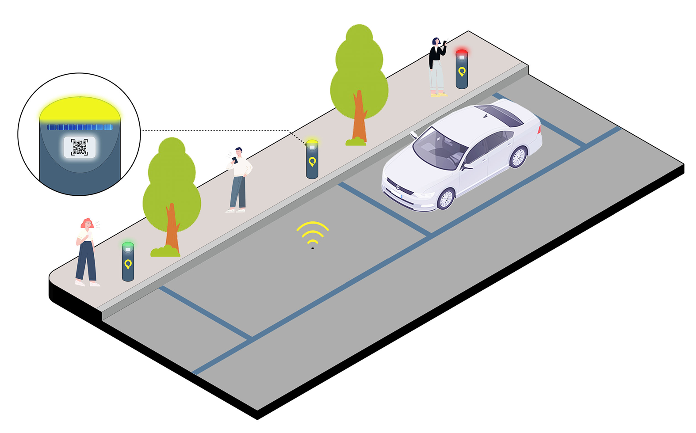
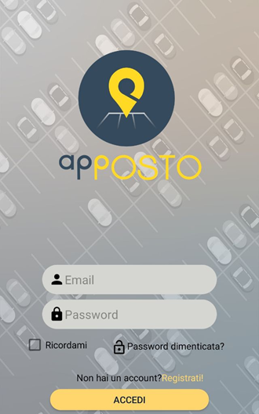
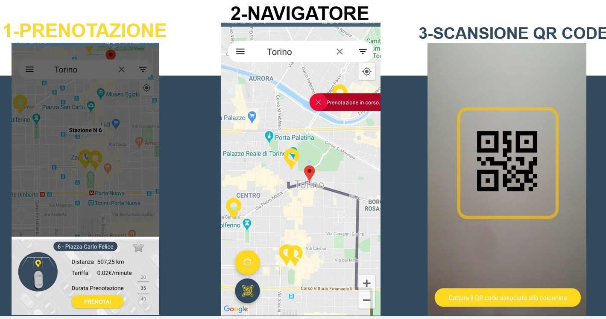
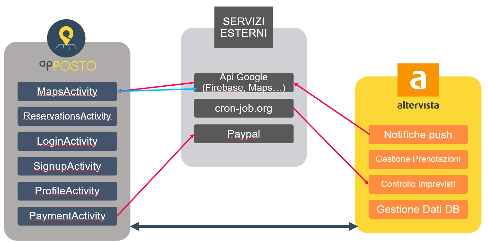

# ApPosto

**ApPosto** è una soluzione innovativa per affrontare il problema della gestione dei parcheggi nei centri urbani. Sfruttando le tecnologie IoT e una piattaforma digitale, il sistema semplifica la ricerca e l'utilizzo dei parcheggi, migliorando l'efficienza e l'esperienza utente.

## Obiettivi principali
- **Riduzione dei tempi di ricerca**: Gli utenti possono individuare rapidamente un parcheggio disponibile grazie a una mappa interattiva.
- **Gestione efficiente dei posti**: Sensori IoT monitorano in tempo reale la disponibilità dei parcheggi.
- **Prenotazioni smart**: Possibilità di prenotare e navigare verso il posto desiderato.
- **Pagamenti digitali**: Ricarica del wallet e pagamenti tramite API di PayPal.
- **Gestione degli imprevisti**: Soluzioni automatiche per eventi come occupazioni improprie degli stalli.

## Ecosistema IoT
Il sistema si basa su un'architettura IoT che comprende:
1. **Sensori**: Dispositivi basati su Arduino per rilevare la presenza di veicoli negli stalli.
2. **Backend**: Comunicazione dei dati tramite API REST con gestione su Firebase e Altervista.
3. **App mobile**: Interfaccia utente per la visualizzazione, prenotazione e gestione dei pagamenti.

### Sensori e hardware

I sensori rilevano:
- Presenza di veicoli negli stalli.
- Stato corrente del parcheggio.
Questi dati vengono inviati al backend per aggiornare in tempo reale la disponibilità sulla mappa.

## Funzionalità principali dell'app
### Login e registrazione

- Accesso tramite Firebase Authentication.
- Possibilità di utilizzare credenziali Google o registrarsi manualmente.
- Funzioni aggiuntive come "Ricordami" e recupero password.

### Prenotazione

1. **Ricerca dei posti**: Utilizzo di filtri per tariffa, distanza e aree preferite.
2. **Scansione QR Code**: Verifica dell'occupazione e chiusura della prenotazione.
3. **Gestione scadenze**: Notifiche push 10 minuti prima della scadenza con opzioni per prolungare, terminare o ignorare.

### Wallet e pagamenti
- Ricarica tramite API PayPal.
- Visualizzazione del saldo e storico delle transazioni.

### Mappe interattive
- Visualizzazione dei parcheggi disponibili.
- Navigazione verso il parcheggio selezionato.
- Possibilità di aggiungere aree preferite con nomi personalizzati.

### Storico e gestione preferiti
- Lista delle prenotazioni concluse.
- Gestione delle aree preferite con opzioni per modificare o eliminare.

## Architettura del sistema

### Frontend
- Applicazione Android con interfaccia intuitiva per una gestione completa delle funzionalità.

### Backend
- **Firebase Cloud** per notifiche e autenticazione.
- **Altervista DB** per la gestione delle prenotazioni.
- **API REST** per la comunicazione tra frontend e dispositivi IoT.

### Persistenza dei dati
- **In locale**: Preferenze utente e credenziali salvate in storage interno.
- **In remoto**: Dati su Firebase e Altervista per garantire continuità.

## Gestione degli imprevisti
1. **Occupazione impropria**: Notifiche all'utente e opzioni di reindirizzamento.
2. **Scadenze imminenti**: Promemoria e possibilità di estendere la prenotazione.

## Risorse aggiuntive
Nella cartella del progetto sono inclusi:
- **Slide di presentazione**: Per comprendere gli obiettivi e i dettagli del sistema.
- **Schema SQL**: Per configurare il database su Altervista.

## Nota
Questo progetto è stato sviluppato come parte di un corso universitario. Per eventuali dubbi o suggerimenti, contatta il responsabile del progetto tramite la sezione "Issues" su GitHub.
